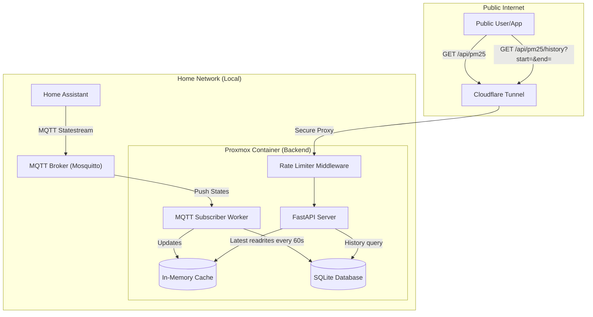

# Backend Master Plan: Public PM2.5 API

## 1. Overview

The goal is to create a secure, high-performance API endpoint hosted in a Proxmox container that exposes real-time and historical PM2.5 air quality data from Home Assistant to the public.

We are using an **event-driven architecture** via MQTT to ensure low latency and minimal load on the Home Assistant core. Readings are persisted to SQLite so data survives server restarts and users can query historical records.

## 2. Architecture



## 3. Core Components

### A. Home Assistant (Data Source)

- **Integration**: `mqtt_statestream`.
- **Function**: Automatically publishes state changes of specific entities to MQTT topics.
- **Target Entities**: `sensor.pm25_living_room`, `sensor.pm25_bedroom`, `sensor.pm25_outdoor`.
- **Topic Pattern**: `homeassistant/sensor/<entity_id>/state`.

### B. MQTT Broker

- **Service**: Mosquitto (likely already running if you use MQTT with HA).
- **Security**: Internal network access only; authenticated with credentials.

### C. Backend Service (The Bridge)

This service runs inside the Proxmox container and consists of three logical parts:

1. **MQTT Subscriber Worker** — background daemon thread. Listens on all PM2.5 topics. On each message:
   - Updates the in-memory cache immediately (for fast latest-value reads).
   - Writes to SQLite at most once per 60 seconds per sensor (downsampling).
   - Silently ignores sensor IDs not listed in `sensors.json`.

2. **SQLite Database** (`pm25.db`) — single `readings(id, sensor_id, value, timestamp)` table with an index on `(sensor_id, timestamp)`. Survives process restarts.

3. **FastAPI Web Server** — two public endpoints:
   - `GET /api/pm25` — returns the latest reading for all sensors from RAM (<5ms).
   - `GET /api/pm25/history?start=&end=[&sensor_id=][&limit=]` — queries SQLite for records in a given ISO8601 time range.
   - Both responses include `latitude` and `longitude` per record (sourced from `sensors.json`) for frontend map rendering.

### D. Sensor Registry (`sensors.json`)

Static config file mapping each sensor's MQTT topic ID to a human-readable name and fixed GPS coordinates. The app only records sensors listed here. Add/remove sensors by editing this file and restarting the service.

### E. Security & Scaling

- **Decoupling**: The API server never talks to Home Assistant directly.
- **Rate Limiting**: 60 req/min per IP on `/api/pm25`; 30 req/min on `/api/pm25/history` via `slowapi`.
- **Cloudflare Tunnel (Cloudflared)**: Maps a public domain to the local port without opening router ports.

## 4. Data Flow

### Real-time (latest value)
1. PM2.5 sensor changes in Home Assistant.
2. HA publishes to `homeassistant/sensor/<id>/state` via MQTT Statestream.
3. MQTT Worker receives the value, updates in-memory cache, and writes to SQLite if ≥60s since last write.
4. Public user hits `GET /api/pm25`.
5. API returns cached value from RAM. Response time <5ms.

### Historical records
1. User hits `GET /api/pm25/history?start=2026-04-01&end=2026-04-10`.
2. API queries SQLite using the timestamp index.
3. Each returned record includes sensor name, location, value, and timestamp.

## 5. API Reference

| Endpoint | Rate limit | Description |
|---|---|---|
| `GET /api/pm25` | 60/min | Latest reading for all sensors |
| `GET /api/pm25/nearest` | 60/min | Nearest sensor to a given lat/lng |
| `GET /api/pm25/history` | 30/min | Historical readings in time range |

**History query parameters:**

| Parameter | Required | Example |
|---|---|---|
| `start` | Yes | `2026-04-01` or `2026-04-01T00:00:00Z` |
| `end` | Yes | `2026-04-10` or `2026-04-10T23:59:59Z` |
| `sensor_id` | No | `pm25_living_room` |
| `limit` | No (default 1000, max 5000) | `500` |

## 6. Implementation Status

| Component | Status |
|---|---|
| MQTT subscriber worker | Done |
| In-memory latest cache | Done |
| SQLite persistence with downsampling | Done |
| `GET /api/pm25` endpoint | Done |
| `GET /api/pm25/nearest` endpoint | Done |
| `GET /api/pm25/history` endpoint | Done |
| Location enrichment per response | Done |
| Rate limiting | Done |
| `sensors.json` registry | Done — **coordinates need to be filled in** |
| `.env` file on server | Pending |
| Proxmox deployment | Pending |
| `cloudflared` setup | Pending |

## 7. Updating the Server

```bash
# Mac — push changes
git add . && git commit -m "your message" && git push

# Proxmox container — pull and restart
cd /opt/pm25-api && git pull
systemctl restart pm25-api
```

If frontend changed, also rebuild before restarting:
```bash
cd /opt/pm25-api/frontend && npm run build
systemctl restart pm25-api
```

---

## 8. Deployment Steps

1. **HA Setup**: Configure `mqtt_statestream` and verify topics in MQTT Explorer.
2. **Fill in coordinates**: Edit `sensors.json` with real lat/lng for each sensor location.
3. **Create `.env`**: Set `MQTT_BROKER`, `MQTT_PORT`, `MQTT_USER`, `MQTT_PASSWORD` on the container.
4. **Install dependencies**: `pip install -r requirements.txt`
5. **Run**: `uvicorn main:app --host 0.0.0.0 --port 8000`
6. **Process manager**: Set up `systemd` or `supervisor` to keep the process alive on reboot.
7. **Public Exposure**: Set up `cloudflared` on the container.
